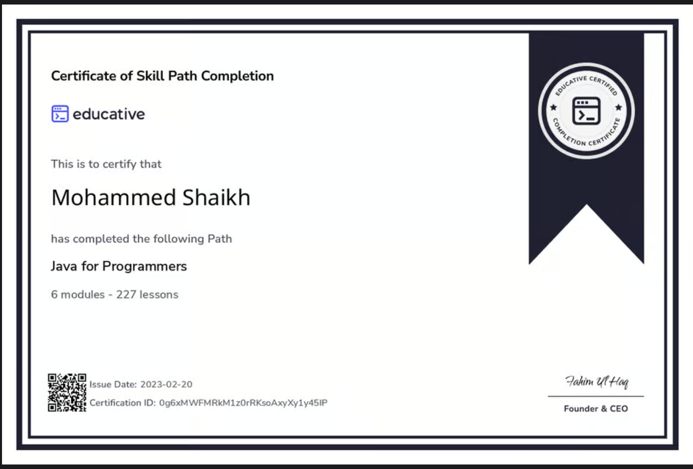
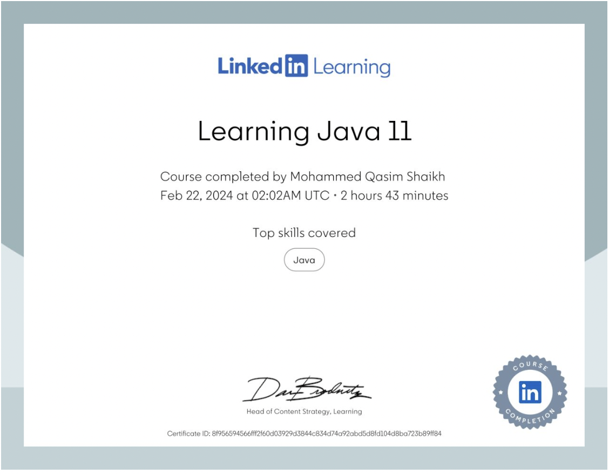

<h2>< 👋🏼 Hello, I'm Mohammed Shaikh, Software Engineer /></h2>

Welcome to my GitHub profile! I'm a Software Engineer passionate about building efficient solutions with modern web technologies.

Here are some the things I am proficient in:

### 🛠 &nbsp;Languages
&nbsp;
&nbsp;
&nbsp;
&nbsp;
&nbsp;
&nbsp;
&nbsp;
&nbsp;
&nbsp;
&nbsp;
&nbsp;
...

- 🔭 - 🔭 I’m currently working on a Gemini Quiz Application, building quizzes powered by Gemini AI. It will change the way people experience quizzes
    
- 🌱 - 🌱 I’m currently learning advanced ASP.NET to develop scalable web applications.

- 📫 Reach out to me: [Email](mailto:mqshaikh8@gmail.com) - [LinkedIn](https://www.linkedin.com/in/mohammed-qasim-shaikh-597194161/)

### 🏅 &nbsp;Certifications

- <Strong> Java for Programmers </Strong> - Educative
   
  

- <Strong> Java for Programmers </Strong> - Linkedin
   
  

- <Strong> React: State Management</Strong> - Linkedin
   
  

- ⚡ Thank you for making it this far, Here are some corny tech jokes: ...
- 
 <h4> Why do programmers prefer dark mode? </h4> - Because the light attracts bugs! 🐛

  

    
<strong> More corny jokes</strong>

      <ul>
        <li>
          
 <h4> Why do programmers prefer dark mode? </h4> - Because the light attracts bugs! 🐛

        </li>
        <li>
          
 <h4> Why was the JavaScript developer sad? </h4> - Because he didn’t know how to null his feelings. 😢

        </li>
        <li>
          
 <h4> Why do Python programmers wear glasses? </h4> - Because they can't C! 🐍👓 

        </li>
        <li>
          
 <h4> How do you comfort a JavaScript bug? </h4> - You console it! 😆

        </li>
      </ul>
  

